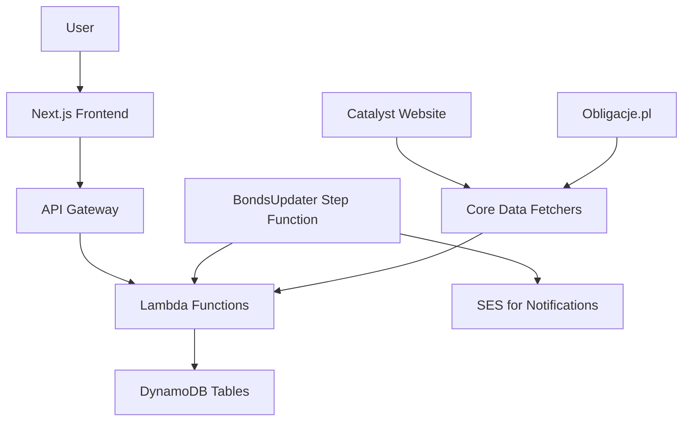

# CatalystViewer Architecture Documentation

## Overview

CatalystViewer is a web application for viewing and analyzing bond market data, specifically Polish Treasury bonds (Obligacje Skarbowe). The application fetches data from external sources, stores it in AWS DynamoDB, and provides a user interface for browsing bond reports and statistics.

The project is built as a monorepo using pnpm workspaces, with infrastructure as code using SST (Serverless Stack Toolkit) on AWS.

## High-Level Architecture

## Components

### Core Package (`packages/core`)

The core package contains the business logic for fetching, processing, and storing bond data.

**Key Modules:**
- **Bonds**: Defines TypeScript types for bond details and current values.
- **Catalyst**: Fetches bond quotes and statistics from the Catalyst website (catalyst.com.pl).
- **ObligacjePL**: Scrapes bond information from obligacje.pl.
- **Statistics**: Computes liquidity metrics like average turnover, trading days ratio, and average spread.
- **Storage**: Interfaces for DynamoDB tables (BondDetails, BondStatistics, Profiles).

**Dependencies:** AWS SDK, Axios, date-fns, Ramda, simple-statistics, xlsx.

### Functions Package (`packages/functions`)

Contains AWS Lambda functions that handle API requests and background tasks.

**Functions:**
- `getProfile`: Retrieves user profile settings.
- `updateProfile`: Updates user profile settings.
- `getBondReports`: Fetches bond details from DynamoDB.
- `getBondQuotes`: Retrieves historical bond quotes.
- `updateBondReports`: Background job to update bond data (fetches from sources, computes statistics, stores in DB).
- `sendNotification`: Sends email notifications about bond updates.

**Dependencies:** AWS SDK (DynamoDB, SES, SSM), date-fns, Pug (for email templates), Ramda.

### Web Package (`packages/web`)

A Next.js application providing the user interface.

**Features:**
- User authentication via AWS Cognito.
- Bond reports browser with filtering, sorting, and customizable views.
- Charts for bond statistics using Recharts.
- Profile management for user settings.

**Dependencies:** Next.js, React, Material-UI, AWS Amplify, Recharts, Tailwind CSS.

## Infrastructure (SST Stacks)

### BondsService Stack
- **Cognito User Pool**: For user authentication.
- **DynamoDB Tables**:
  - `Profiles`: User settings (partition key: userName).
  - `BondDetails`: Bond information (partition key: bondType, sort key: name#market).
  - `BondStatistics`: Historical quotes (partition key: name#market, sort key: year#month).
- **API Gateway**: REST API with JWT authorization.
  - Routes: `/api/profile` (GET/PUT), `/api/bonds` (GET), `/api/bondQuotes` (GET).

### Frontend Stack
- **Next.js Site**: Deployed to AWS with custom domain (catalyst.albedoonline.com).
- Environment variables for API URL and Cognito config.

### BondsUpdater Stack
- **Lambda Function**: `updateBondReports` - Fetches data, updates DB.
- **Step Function**: Orchestrates update process and conditional email notifications.
- **EventBridge Rule**: Scheduled execution (weekdays at 9:00, 12:00, 15:00 CET).
- **SES Integration**: For sending update notifications.

## Data Flow

1. **Data Ingestion**:
   - BondsUpdater Lambda runs periodically.
   - Fetches current quotes from Catalyst website.
   - Fetches latest statistics from Catalyst.
   - For each bond, retrieves detailed info from obligacje.pl if not already stored.
   - Computes liquidity statistics from historical data.
   - Updates BondDetails and BondStatistics tables.

2. **User Interaction**:
   - User logs in via Cognito.
   - Frontend loads user profile settings.
   - API calls fetch bond data from DynamoDB.
   - User can browse bonds, view statistics, customize settings.

3. **Notifications**:
   - After updates, if new bonds are added or existing bonds are deactivated, email notifications are sent.

## Deployment

- **Development**: `sst dev` for local development with hot reloading.
- **Production**: `sst deploy` to AWS.
- **Monorepo Management**: pnpm workspaces for dependency management.
- **CI/CD**: Not specified in code, likely manual or external CI.

## Key Technologies

- **Backend**: Node.js, TypeScript, AWS Lambda, DynamoDB, API Gateway.
- **Frontend**: Next.js, React, Material-UI, Tailwind CSS.
- **Infrastructure**: SST, AWS CDK, Cognito, SES, EventBridge, Step Functions.
- **Data Sources**: Catalyst (catalyst.com.pl), Obligacje.pl.
- **Libraries**: Ramda (functional programming), date-fns (date handling), simple-statistics (stats), Recharts (charts).

## Security

- Authentication via AWS Cognito with JWT tokens.
- API routes protected by JWT authorizer.
- SES email sending with specific IAM permissions.
- SSM for storing notification recipients.

## Scalability and Performance

- Serverless architecture scales automatically.
- DynamoDB provides low-latency data access.
- Lambda functions have appropriate timeouts and memory allocations.
- API throttling configured (burst: 2, rate: 2 requests/second).

## Monitoring and Logging

- CloudWatch for logs and metrics.
- Console logging in Lambda functions for debugging.

## Future Considerations

- Add more data sources.
- Implement real-time updates (WebSockets).
- Enhance analytics and reporting features.
- Add unit and integration tests.