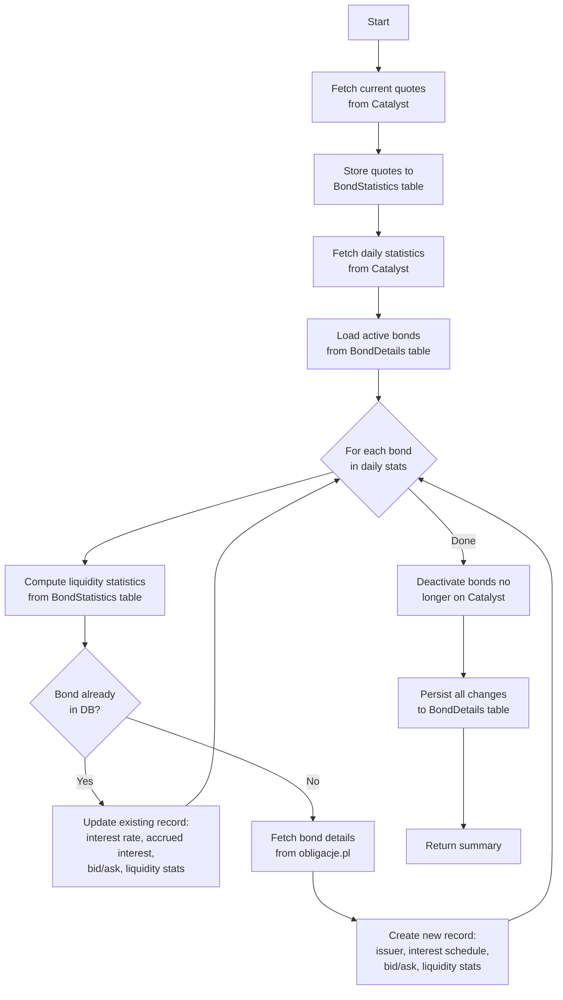

# Bond Update Process

This document describes the bond data update process implemented in
`packages/functions/src/bonds/updateBondReports.ts`.

The `updateBondReports` Lambda function runs on a schedule (weekdays at 09:00,
12:00, and 15:00 CET, via EventBridge) and is responsible for keeping the
`BondDetails` and `BondStatistics` DynamoDB tables up to date.

## Process Overview



## Steps in Detail

### 1. Fetch Current Quotes — Catalyst

**Function:** `getCurrentCatalystBondsQuotes()`  
**Source:** Catalyst (catalyst.gpw.pl)

Fetches the live order-book and transaction snapshot for every listed bond.
Each record contains:

| Field | Description |
|---|---|
| `name` / `market` | Bond identifier and market segment |
| `referencePrice` | Official reference price |
| `lastDateTime` / `lastPrice` | Most recent transaction time and price |
| `bidCount` / `bidVolume` / `bidPrice` | Best bid side of the order book |
| `askPrice` / `askVolume` / `askCount` | Best ask side of the order book |
| `transactions` / `volume` / `turnover` | Intraday trade activity |

### 2. Store Quotes to BondStatistics Table

**Table:** `BondStatistics` (DynamoDB)

Bonds with no activity (no turnover and no bid/ask) are skipped. For the
remaining bonds, a quote entry is upserted into the `BondStatistics` table
(partitioned by `name#market`, sorted by `year#month`). The entry captures:

- bid and ask prices
- close price and transaction count (only if a transaction occurred today)
- volume and turnover (only if a transaction occurred today)

This historical data is later used for liquidity calculations.

### 3. Fetch Daily Statistics — Catalyst

**Function:** `getLatestCatalystDailyStatistics()`  
**Source:** Catalyst (catalyst.gpw.pl)

Fetches the official end-of-day statistics for every bond. Each record
contains:

| Field | Description |
|---|---|
| `isin` | ISIN code |
| `market` | Market segment |
| `type` | Bond type (e.g. corporate, municipal) |
| `nominalValue` | Face value |
| `maturityDay` | Maturity date |
| `currentInterestRate` | Current coupon rate |
| `accuredInterest` | Accrued interest |
| `tradingCurrency` | Currency |

### 4. Load Active Bonds from DynamoDB

All records with `status = 'active'` are loaded from the `BondDetails` table
to determine which bonds need to be created vs. updated.

### 5. Per-Bond Processing

For every bond present in the daily statistics:

#### 5a. Compute Liquidity Statistics

Using the last 30 calendar days of stored quotes from the `BondStatistics`
table, three metrics are computed:

| Metric | Description |
|---|---|
| `averageTurnover` | Mean daily turnover in PLN |
| `tradingDaysRatio` | Fraction of business days on which the bond was traded |
| `averageSpread` | Mean bid–ask spread |

#### 5b. Update Existing Bond

If the bond is already in `BondDetails`, the following fields are refreshed:

- `currentInterestRate`, `accuredInterest` (from daily Catalyst stats)
- `referencePrice`, `lastPrice`, `lastDateTime`, bid/ask fields (from live quotes)
- `averageTurnover`, `tradingDaysRatio`, `averageSpread` (computed)

#### 5c. Create New Bond

If the bond is not yet in `BondDetails`, its static details are fetched from
obligacje.pl.

**Function:** `getBondInformation(name)`  
**Source:** obligacje.pl

| Field | Description |
|---|---|
| `issuer` | Issuer name |
| `issueValue` | Total issue size |
| `interestType` | Fixed or variable |
| `interestVariable` | Variable rate component (e.g. WIBOR 3M) |
| `interestConst` | Fixed margin added to variable rate |
| `interestFirstDays` | Coupon period start dates |
| `interestRightsDays` | Interest rights record dates |
| `interestPayoffDays` | Coupon payment dates |

A full `BondDetails` record is then constructed by combining Catalyst data,
obligacje.pl data, and computed liquidity statistics.

### 6. Deactivate Removed Bonds

Any bond currently stored with `status = 'active'` that does not appear in the
latest Catalyst daily statistics is marked `status = 'inactive'`. This handles
bonds that have matured, been delisted, or suspended.

### 7. Persist Changes

All updated, new, and deactivated records are batch-written to the
`BondDetails` table in a single `storeAll` call.

## External Services

| Service | Called by | Frequency | Data Fetched |
|---|---|---|---|
| **Catalyst** (catalyst.gpw.pl) | `getCurrentCatalystBondsQuotes` | Every run | Live quotes: bid/ask, last price, volume, turnover |
| **Catalyst** (catalyst.gpw.pl) | `getLatestCatalystDailyStatistics` | Every run | Daily stats: ISIN, interest rate, accrued interest, maturity |
| **obligacje.pl** | `getBondInformation` | Once per new bond | Bond details: issuer, issue value, interest type and schedule |

## Return Value

The function returns an `UpdateBondsResult` summarising the run:

```ts
{
  bondsUpdated: number;          // count of records updated
  newBonds: UpdatedBond[];       // newly added bonds
  bondsDeactivated: UpdatedBond[]; // bonds marked inactive
  bondsFailed: Record<string, string>; // bonds that errored, with reason
}
```

Errors for individual bonds are caught and recorded in `bondsFailed` so that
one failing bond does not abort the entire update.
